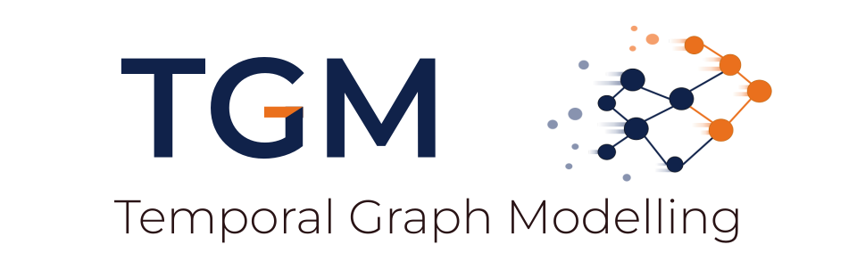

<a id="readme-top"></a>



<div align="center">
<h3 style="font-size: 22px">Efficient and Modular ML on Temporal Graphs</h3>
<a href="https://tgm.readthedocs.io/en/latest"/><strong style="font-size: 18px;">Read Our Docs»</strong></a>
<a href="https://github.com/tgm-team/tgm"/><strong style="font-size: 18px;">Read Our Paper»</strong></a>
<br/>
<br/>

[](https://github.com/tgm-team/tgm/stargazers)
[](https://github.com/tgm-team/tgm/actions/workflows/testing.yml)
[](https://github.com/tgm-team/tgm/actions/workflows/ruff.yml)

</div>

## About The Project

TGM is a research library designed to accelerate training workloads over dynamic graphs and facilitate prototyping of temporal graph learning methods.

Our main goal is to provide an efficient abstraction over dynamic graphs to enable new practitioners to quickly contribute to research in the field. We natively support both discrete and continuous-time graphs.

> \[!NOTE\]
> TGM is still alpha software, and may introduce breaking changes.

### Library Highlights

- :zap: It's not that fast yet but it will be soon :)
- :hourglass_flowing_sand: First library to support both discrete and continuous-time graphs
- :wrench: Built-in support for [TGB datasets](https://tgb.complexdatalab.com/), MRR-based link prediction, and Node Property Prediction
- :sparkles: Modular, intuitive API for rapid model prototyping
- :atom: Efficient dataloading with edge and time-based batching
- :heavy_check_mark: Validated implementations of popular TG methods

### Supported Methods

We aim to support the following temporal graph learning methods. If you want us to prioritize a new method, please open an [issue](https://github.com/tgm-team/tgm/issues) and feel free [to discuss them with us](https://github.com/tgm-team/tgm/discussions).

- :white_check_mark: [EdgeBank](https://arxiv.org/abs/2207.10128)
- :white_check_mark: [GCN](https://arxiv.org/abs/1609.02907)
- :white_check_mark: [GC-LSTM](https://arxiv.org/abs/1812.04206)
- :white_check_mark: [GraphMixer](https://arxiv.org/abs/2302.11636)
- :white_check_mark: [TGAT](https://arxiv.org/abs/2002.07962)
- :white_check_mark: [TGN](https://arxiv.org/abs/2006.10637)
- :white_large_square: [DygFormer](https://arxiv.org/abs/2303.13047)
- :white_large_square: [TNCN](https://arxiv.org/abs/2406.07926)
- :white_large_square: [DyGMamba](https://arxiv.org/abs/2408.04713)
- :white_large_square: [NLB](https://arxiv.org/abs/2402.01964)
- :white_large_square: [NAT](https://arxiv.org/abs/2209.01084)

### Performance Benchmarks

Work in progress.

## Installation

The current recommended way to install TGM is from source.

#### Using [uv](https://docs.astral.sh/uv/) (recommended)

```sh
# Create and activate your venv
uv venv my_venv --python 3.10 && source my_venv/bin/activate

# Install the wheels into the venv
uv pip install git+https://github.com/tgm-team/tgm.git

# Test the install
python -c 'import tgm; print(tgm.__version__)'
```

#### Using [pip](https://pip.pypa.io/en/stable/installation/)

```sh
# Create and activate your venv
python3.10 -m venv my_venv && source my_venv/bin/activate

# Install the wheels into the venv
pip install git+https://github.com/tgm-team/tgm.git

# Test the install
python -c 'import tgm; print(tgm.__version__)'
```

These steps should work on Linux systems. We have not officially tested on other platforms, so expect additional work may be required. If you encounter issues on your system, please open an [issue](https://github.com/tgm-team/tgm/issues) and feel free [to discuss them with us](https://github.com/tgm-team/tgm/discussions).

### Windows

To enable GPU on non-linux platforms, you will need to manually install the appropriate torch wheels for your drivers. For instance, for *cuda:12.4*, follow the steps above and then issue:

```sh
uv pip install torch torchvision torchaudio --index-url https://download.pytorch.org/whl/cu124
```

## Quick Tour for New Users


### Running Pre-packaged Examples

Start by syncing additional dependencies in our example scripts:

```sh
uv sync --group examples
```

For this example, we'll run [TGAT](https://arxiv.org/abs/2002.07962) dynamic link-prediction on [tgbl-wiki](https://tgb.complexdatalab.com/docs/leader_linkprop/#tgbl-wiki-v2). We'll use standard parameters on run on GPU. We show some explicit arguments for clarity:

```
python examples/linkproppred/tgat.py \
  --dataset tgbl-wiki \
  --bsize 200 \
  --device cuda \
  --epochs 1 \
  --n-nbrs 20 20 \
  --sampling recency
```

> \[!TIP\]
> Refer to our [our docs](https://tgm.readthedocs.io/) for more information and TG example recipes.

### Creating a new model

Work in progress.

## Documentation

Documentation along with a quick start guide can be found on the [docs website](https://tgm.readthedocs.io/).

## Citation

Please cite [our paper](https://github.com/tgm-team/tgm) if your use this code in your own work:

```
@article{TODO,
title   = "TODO",
author  = "TODO"
journal = "TODO",
url     = "TODO"
year    = "2025",
}
```

## Contributing

If you notice anything unexpected, or would like to propose a new feature, please open an [issue](https://github.com/tgm-team/tgm/issues) and feel free [to discuss them with us](https://github.com/tgm-team/tgm/discussions).

To learn more about making a contribution to TGM see our [contribution guide](./.github/CONTRIBUTING.md).

<p align="right">(<a href="#readme-top">back to top</a>)</p>
