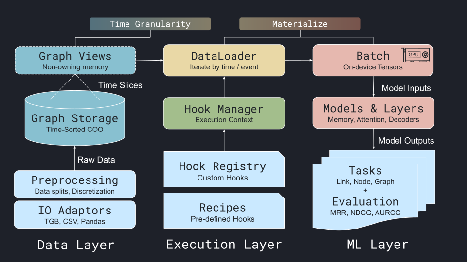

TGM is organized as a **three-layer architecture**:

1. **Data Layer**

   - Immutable, time-sorted coordinate-format graph storage with lightweight, concurrency-safe graph views.
   - Efficient time-based slicing and binary search over timestamps, enabling fast recent-neighbor retrieval.
   - Supports continuous-time and discrete-time loading, with vectorized snapshot creation.
   - Extensible backend allows alternative storage layouts for future models.

1. **Execution Layer**

   - The DataLoader is responsible for iterating through the temporal graph data stream by time or events based on the user-defined granularity.
   - HookManager orchestrates transformations during data loading (e.g., temporal neighbor sampling), dynamically adding relevant attributes to the Batch yielded by the dataloader.
   - Hooks can be combined and registered under specific conditions (analytics, training, etc.).
   - Pre-defined recipes simplify common setups (e.g. TGB link prediction) and prevent common pitfalls (e.g., mismanaging negatives).

1. **ML Layer**

   - Materializes batches directly on-device for model computation.
   - Supports **node-, link-, and graph-level prediction**.

> \[!TIP\]
> Check out [our paper](https://tgm.readthedocs.io/) for technical details.
