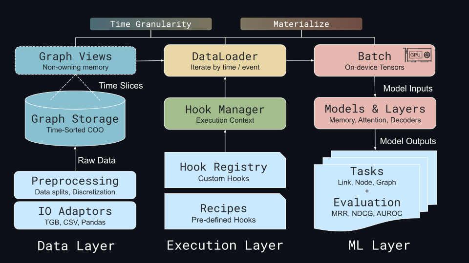

**High-Level Design and Architecture of TGM**

Dotted lines denote lazy execution with shallow memory ownership. Solid arrows denote the passage of ownership and data materialization on-device. Users load a dynamic graph into a storage backend and register message-passing hooks. At runtime, the hooks execute and materialize the relevant sub-graph/feature vectors automatically when yielding a batch of data. Caching layers in both view objects and storage prevent duplicate computational work.

### Storage Backend

The TGM storage backend provides a read-only, static interface for querying dynamic graph data-timestamps, edge pairs, features, and node IDs. Optimized for offline training, the backend uses caching to accelerate access and supports extensibility for particular hardware or access patterns in the future.

Our default implementation uses a chronologically sorted COO format, enabling binary search over timestamps and linear scans within time windows. A temporal index cache further reduces query costs. We plan to add a Temporal Compressed Sparse Row (TCSR) backend which organizes time-aware neighbour lists in contiguous memory blocks. Though expensive to construct, TCSR aligns with OpenDG’s immutable data assumption.

### Graph Views and Lazy Slice Tracking

TGM exposes immutable graph views as the primary user interface. A Graph View holds a reference to the storage backend and contains a TimeDelta for temporal resolution, a Slice Tracker for subgraph operations, and a local cache for computed properties. The Slice Tracker records metadata about requested operations on the Graph View. Immutability guarantees that views are safe for concurrent access. Read-only queries are delegated to the backend and automatically cached for efficiency. Subgraphs are lazily materialized at runtime, enabling optimized query execution while abstracting system-level optimizations behind a simple interface.

### Temporal Index Management

TGM uses a TimeDelta abstraction to define temporal granularity—whether timestamps represent ordered indices or real durations (e.g., seconds). This decouples time semantics from data layout and informs access patterns and iteration. The dataloader leverages TimeDelta to support batch iteration by event count (e.g., 200 events) or fixed time windows (e.g., 500 ms), enabling batching strategies that align with GPU efficiency or time-aware modelling, where event density varies—an approach that has demonstrated improved performance in recent dynamic link prediction tasks.

### Graph Hooks

TGM supports flexible prototyping via a modular hook mechanism. Hooks are composable transformations applied to sliced graph views during data iteration, enabling custom logic, such as memory updates or neighbourhood sampling, without modifying core code. Hooks we currently support include Materialize: converts a graph slice into dense edge index/feature tensors, Negative Sampling: generates negative edges for link prediction, and Temporal Neighbourhood: retrieves node interaction histories using online buffering or backend queries.

### Neural Layers and Runtime

TGM provides a PyTorch-Geometric-style frontend with modular components tailored for temporal graph learning, including time encoders, memory modules, attention layers, and link decoders. The current support includes validated implementations of temporal self-attention and time encoding, with additional components planned for future release.
